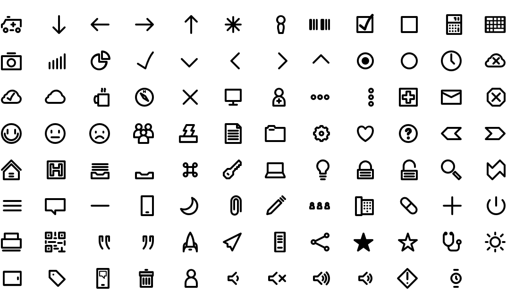

# Eleven

An outline icon font with commonly-used UI glyphs. Good for mobile and desktop. Use and enjoy!

# Contributions Welcome

Happy to take pull requests in the `svg` folder if you'd like to add some glyphs.

# Sample

# Made with Love

By Dave Balmer (@Balmer), using these tools:

## IcoMoon.io

While these icons are designed from scratch, http://icomoon.io was used to collect and
convert them into production-ready font files.

## Affinity Designer

Used for design https://affinity.serif.com/en-us/ great design package for Mac.

## Inkscape

Used to render the strokes in the `svg` files. Mostly because Affinity Designer has some
trouble with auto-converting strokes to paths with some odd shapes.

